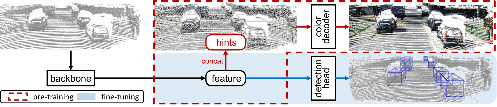

# GPC: Pre-training LiDAR-based 3D Object Detectors through Colorization
**ICLR 2024**

[Tai-Yu Pan](https://tydpan.github.io/), Chenyang Ma, Tianle Chen, [Cheng Perng Phoo](https://www.cs.cornell.edu/~cpphoo/), [Katie Z Luo](https://www.cs.cornell.edu/~katieluo/), [Yurong You](https://yurongyou.com/), [Mark Campbell](https://campbell.mae.cornell.edu/), [Kilian Q Weinberger](https://www.cs.cornell.edu/~kilian/), [Bharath Hariharan](https://www.cs.cornell.edu/~bharathh/), [Wei-Lun Chao](https://sites.google.com/view/wei-lun-harry-chao/home)

[[arXiv]](https://arxiv.org/abs/2310.14592) [[`BibTeX`](#citing-gpc)]



## Introduction
Accurate 3D object detection and understanding for self-driving cars heavily relies on LiDAR point clouds, necessitating large amounts of labeled data to train. In this work, we introduce an innovative pre-training approach, Grounded Point Colorization (GPC), to bridge the gap between data and labels by teaching the model to colorize LiDAR point clouds, equipping it with valuable semantic cues. To tackle challenges arising from color variations and selection bias, we incorporate color as "context" by providing ground-truth colors as hints during colorization. Experimental results on the KITTI and Waymo datasets demonstrate GPC's remarkable effectiveness. Even with limited labeled data, GPC significantly improves fine-tuning performance; notably, on just 20% of the KITTI dataset, GPC outperforms training from scratch with the entire dataset. In sum, we introduce a fresh perspective on pre-training for 3D object detection, aligning the objective with the model's intended role and ultimately advancing the accuracy and efficiency of 3D object detection for autonomous vehicles.

## <a name="CitingGPC"></a>Citing GPC

If you use GPC in your research, please use the following BibTeX entry.

```BibTeX
@inproceedings{pan2023gpc,
  title={Pre-training lidar-based 3d object detectors through colorization},
  author={Pan, Tai-Yu and Ma, Chenyang and Chen, Tianle and Phoo, Cheng Perng and Luo, Katie Z and You, Yurong and Campbell, Mark and Weinberger, Kilian Q and Hariharan, Bharath and Chao, Wei-Lun},
  journal={ICLR},
  year={2024}
}
```
